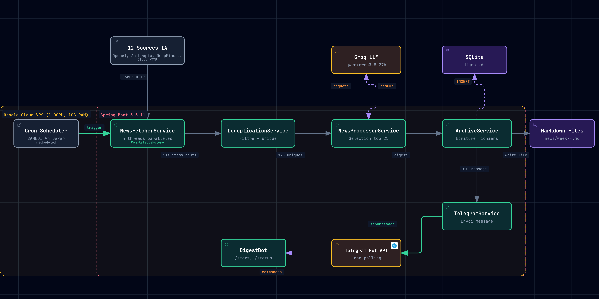
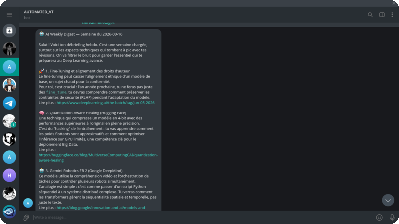

<div align="center">


<br/>


<br/>

<p><em>Pipeline automatique • Scraping IA • LLM • Telegram • Chaque samedi à 9h ☕</em></p>

<br/>


<br/><br/>


&nbsp;&nbsp;&nbsp;


<br/><br/>

</div>


<p align="center">
  <a href="https://academic-and-personal-projects.github.io/NeuralPulse/">
    
  </a>
</p>

<p align="center">
  <a href="https://academic-and-personal-projects.github.io/NeuralPulse/">
    
  </a>
</p>


## C'est quoi NeuralPulse ?

> **NeuralPulse** est un pipeline entièrement automatisé qui traque l'écosystème IA pour toi.  
> Chaque **samedi à 9h**, il scrape **12 sources** (OpenAI, Anthropic, DeepMind…), déduplique, passe tout par un **LLM Groq ultra-rapide**, et t'envoie un digest **pédagogique en français** directement dans **Telegram**.  
> Archivage Markdown automatique. Zéro intervention humaine. ☕

<div align="center">

</div>

---

## Stack Technique

<!-- Logos row -->
<p align="center">
  &nbsp;&nbsp;
  &nbsp;&nbsp;
  &nbsp;&nbsp;
  &nbsp;&nbsp;
  &nbsp;&nbsp;
  &nbsp;&nbsp;
  &nbsp;&nbsp;
  &nbsp;&nbsp;
  
</p>

<br/>

<!-- Explanation table -->
<div align="center">

| Composant | Technologie | Rôle |
|:---------:|:-----------:|:----:|
|  **Java 17** | JDK LTS | Runtime principal |
|  **Spring Boot 3.3** | Framework | Web, scheduling, DI |
|  **SQLite** | JDBC 3.53 | Archivage léger, 0 serveur |
|  **Docker** | Compose | Déploiement reproductible |
|  **Maven** | Build tool | Gestion des dépendances |
|  **Groq API** | LLM Cloud | qwen/qwen3.8-27b — ultra rapide |
|  **TelegramBots** | v10.3.0 | Long-polling, envoi digest |
|  **JSoup** | v1.18.1 | Scraping HTML robuste |
|  **Oracle Cloud** | Free Tier | 1 OCPU, 1GB RAM, VPS |

</div>

---

## Pipeline de traitement

```
                    ╔══════════════════════════════════╗
                    ║  🕘  CRON — Samedi 9h Paris      ║
                    ╚═════════════════╤════════════════╝
                                      │  trigger
                                      ▼
                    ╔══════════════════════════════════╗
                    ║  📡  NewsFetcherService          ║
                    ║  4 threads parallèles            ║
                    ║  OpenAI · Anthropic · DeepMind   ║
                    ║  Meta · Mistral · HuggingFace    ║
                    ║  TheBatch · TLDR · ImportAI      ║
                    ║  Rundown · PapersWithCode · dev  ║
                    ╚═════════════════╤════════════════╝
                                      │  ~514 articles bruts
                                      ▼
                    ╔══════════════════════════════════╗
                    ║  🧹  DeduplicationService        ║
                    ║  Filtre 7 jours                  ║
                    ║  Dédoublonnage par similarité    ║
                    ╚═════════════════╤════════════════╝
                                      │  ~178 uniques
                                      ▼
                    ╔══════════════════════════════════╗
                    ║  🧠  NewsProcessorService        ║
                    ║  → Groq LLM (qwen3.8-27b)        ║
                    ║  Prompt pédagogique FR           ║
                    ║  Top 5-10 news · Markdown        ║
                    ╚═════════════╤══════╤═════════════╝
                                  │      │
               ┌──────────────────┘      └──────────────────┐
               ▼                                            ▼
  ╔════════════════════════╗              ╔═══════════════════════════╗
  ║  💾  ArchiveService    ║              ║  ✈️   TelegramService     ║
  ║  news/week-YYYY-MM.md  ║              ║  sendMessage + Markdown   ║
  ╚════════════════════════╝              ╚═══════════════════════════╝
```

---

## 📨 Output — Telegram

<p align="center">
  <picture>
    
  </picture>
  <br/>
  <sub><sup>📱 Aperçu du bot Telegram — <strong>AUTOMATED_VT</strong> · digest du 2026-09-16</sup></sub>
</p>

> **Format du message :**
> ```
> AI Weekly Digest — Semaine du {date}
>
> {résumé formaté par le LLM}
>
> ---
> Sources : OpenAI, Anthropic, DeepMind, ...
> Archivé dans : news/week-{date}.md
> ```

---

## Sources scrapées — 12 feeds

<div align="center">

| # | Source | Type | Fréquence |
|---|--------|------|-----------|
| 🟢 | **OpenAI Blog** | Blog officiel | Hebdo |
| 🟢 | **Anthropic Research** | Blog officiel | Hebdo |
| 🟢 | **Google DeepMind** | Blog officiel | Hebdo |
| 🟢 | **Meta AI** | Blog officiel | Hebdo |
| 🟢 | **Mistral AI** | Blog officiel | Hebdo |
| 🔵 | **Hugging Face** | Blog + RSS | Quotidien |
| 🔵 | **The Batch** *(Andrew Ng)* | Newsletter | Hebdo |
| 🔵 | **TLDR AI** | Newsletter | Quotidien |
| 🔵 | **Import AI** *(Jack Clark)* | Newsletter | Hebdo |
| 🔵 | **The Rundown AI** | Newsletter | Quotidien |
| 🟡 | **Papers With Code** | Papers trending | Quotidien |
| 🟡 | **daily.dev** | Agrégateur | Quotidien |

</div>

---

## Déploiement

### 1. Build

```bash
mvn clean package -DskipTests
```

### 2. Configuration — `.env`

```env
TELEGRAM_BOT_TOKEN=123456:ABC-DEF...
TELEGRAM_CHAT_ID=-100xxxxxxxxx
GROQ_API=gsk_xxxxxxxxxxxxxxxxxxxxx
APP_PORT=8080
```

### 3. Docker Compose (Production)

```bash
docker compose up -d --build

# Vérifier l'état
curl http://localhost:8080/health
```

### 4. Déploiement VPS (Oracle Cloud)

```bash
# Build local
mvn clean package -DskipTests

# Upload sur le VPS
sudo mkdir -p /opt/ai-news-digest && sudo chown ubuntu:ubuntu /opt/ai-news-digest
scp target/ai-news-digest-1.0.0.jar ubuntu@<VPS_IP>:/opt/ai-news-digest/

# Service systemd
sudo systemctl enable ai-news-digest
sudo systemctl start ai-news-digest

# Logs live
sudo journalctl -u ai-news-digest -f
```

---

## Endpoints API

| Route | Méthode | Description |
|-------|:-------:|-------------|
| `/health` | `GET` | État du service + timestamp dernière exécution |
| `/api/test-digest` | `POST` | Déclenche un digest manuel (dev/debug) |

**Exemple `/health` :**
```json
{
  "status": "ok",
  "version": "1.0.0",
  "lastRun": "2026-09-13T09:00:00Z"
}
```

---

## Structure du projet

```
neuralpulse/
├── 📁 src/
│   └── main/
│       ├── java/com/ainews/
│       │   ├── 🚀 AiNewsApplication.java
│       │   ├── 📁 config/           # AppConfig, GroqConfig
│       │   ├── 📁 model/            # NewsItem POJO
│       │   ├── 📁 service/          # Fetch, Processor, Telegram, Archive, Dedup
│       │   ├── 📁 source/           # 12 SourceFetcher implementations
│       │   ├── 📁 scheduler/        # WeeklyDigestScheduler (Cron SAT 9h)
│       │   └── 📁 controller/       # HealthController
│       └── resources/
│           ├── application.yml
│           ├── application-dev.yml
│           └── application-prod.yml
├── 📁 news/                         # Archive Markdown (runtime)
├── 📁 docs/                         # Architecture diagram
├── 📁 logs/                         # Rotation journalière, max 10MB
├── 🐳 Dockerfile
├── 🐳 docker-compose.yml
├── ⚙️  .env.example
└── 📋 pom.xml
```

---

## Design Patterns

```java
// Strategy Pattern — chaque source implémente l'interface
public interface SourceFetcher {
    String getSourceName();
    List<NewsItem> fetchLastWeek();
}

// Spring DI — orchestrateur agnostique aux sources
@Service
public class NewsAggregatorService {
    private final List<SourceFetcher> sources; // 12 implémentations injectées

    public NewsAggregatorService(List<SourceFetcher> sources) {
        this.sources = sources;
    }
}
```

> Patterns : **Strategy** • **Template Method** • **Factory (Spring DI)** • **Constructor Injection**

---

## ⚙️ Contraintes infra

```yaml
RAM allouée à Java : 384 MB  (-Xmx384m)
CPU               : 1/8 OCPU Oracle
Logs              : rotation journalière, max 10 MB/fichier
Groq API          : 30 req/min · 14 400 req/jour (gratuit)
```

---

<div align="center">


