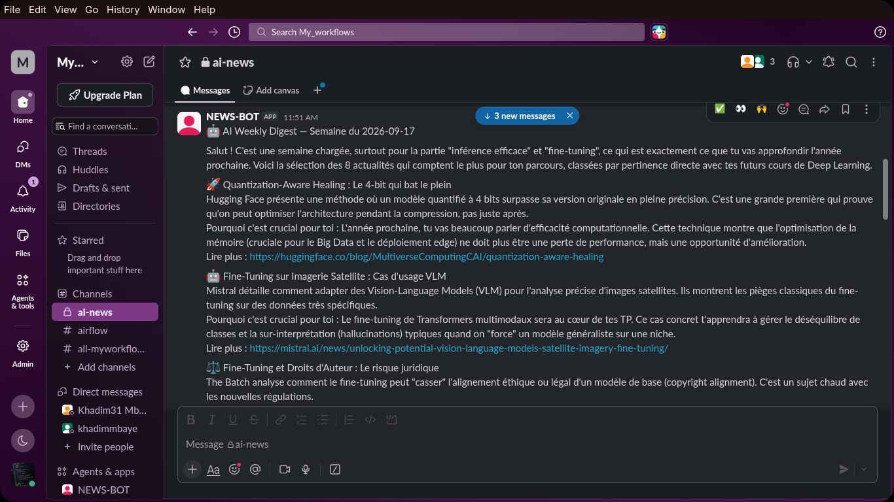

<!-- Header Section -->
<div align="center">


<br/><br/>


<p>
  <b><i>Pipeline automatique • Scraping IA • LLM • Telegram + Slack • Chaque samedi à 9h ☕</i></b>
</p>

<!-- Badges -->
<p>
  
  
  
  
</p>
<p>
  
  
</p>

<br/>


<br/><br/>

</div>


<div align="center">
  <a href="https://academic-and-personal-projects.github.io/NeuralPulse/architecture.html">
    
  </a>
  <br/><br/>
  <a href="https://academic-and-personal-projects.github.io/NeuralPulse/architecture.html">
    
  </a>
</div>

<br/>


---

## 🌌 C'est quoi NeuralPulse ?

<div align="center">
  <table>
    <tr>
      <td width="70%">
        <blockquote>
          <p><b>NeuralPulse</b> est un pipeline entièrement automatisé qui traque l'écosystème IA pour toi.</p>
          <p>Chaque <b>samedi à 9h</b>, il scrape <b>12 sources</b> (OpenAI, Anthropic, DeepMind…), déduplique, passe tout par un <b>LLM Groq ultra-rapide</b>, et t'envoie un digest <b>pédagogique en français</b> directement dans <b>Telegram</b> et <b>Slack</b>.</p>
          <p><i>Archivage Markdown automatique. Zéro intervention humaine. ☕</i></p>
        </blockquote>
      </td>
      <td width="30%" align="center">
        
      </td>
    </tr>
  </table>
</div>

---

## ⚡ Stack Technique

<div align="center">

<p>
  &nbsp;&nbsp;&nbsp;
  &nbsp;&nbsp;&nbsp;
  &nbsp;&nbsp;&nbsp;
  &nbsp;&nbsp;&nbsp;
  &nbsp;&nbsp;&nbsp;
  &nbsp;&nbsp;&nbsp;
  &nbsp;&nbsp;&nbsp;
  &nbsp;&nbsp;&nbsp;
  
</p>

<br/>

| Composant | Technologie | Rôle |
|:---------|:-----------|:----|
|  **Java 17** | JDK LTS | Runtime principal |
|  **Spring Boot 3.3** | Framework | Web, scheduling, DI |
|  **SQLite** | JDBC 3.53 | Archivage léger, 0 serveur |
|  **Docker** | Compose | Déploiement reproductible |
|  **Maven** | Build tool | Gestion des dépendances |
|  **Groq API** | LLM Cloud | qwen/qwen3.8-27b — ultra rapide |
|  **TelegramBots** | v10.3.0 | Long-polling, envoi digest |
|  **Slack API Client** | v1.51.0 | Web API, envoi digest |
|  **JSoup** | v1.18.1 | Scraping HTML robuste |
|  **Oracle Cloud** | Free Tier | 1 OCPU, 1GB RAM, VPS |

</div>

---

## 📡 Outputs & Intégrations

<div align="center">
  <table>
    <tr>
      <td width="50%" align="center">
        <h3>📨 Telegram</h3>
        
        <br/>
        <sub>📱 Bot : <b>AUTOMATED_VT</b></sub>
      </td>
      <td width="50%" align="center">
        <h3>💬 Slack</h3>
        
        <br/>
        <sub>💬 Bot : <b>NEWS-BOT</b> (#ai-news)</sub>
      </td>
    </tr>
  </table>
</div>

<details>
<summary><b>🔍 Voir les détails de configuration et format</b></summary>
<br/>

**Format du message Telegram :**
```text
AI Weekly Digest — Semaine du {date}

{résumé formaté par le LLM}

---
Sources : OpenAI, Anthropic, DeepMind, ...
Archivé dans : news/week-{date}.md
```

**Configuration Slack :**
```env
SLACK_BOT_TOKEN=xoxb-xxxxx        # Bot OAuth Token (scope: chat:write)
SLACK_CHANNEL_ID=C0xxxxxxx        # Channel ID du workspace
```
</details>

---

## 🌐 Sources Scrapées (12 Feeds)

<div align="center">

| Status | Source | Type | Fréquence |
|:---:|:---|:---|:---|
| 🟢 | **OpenAI Blog** | Blog officiel | Hebdo |
| 🟢 | **Anthropic Research** | Blog officiel | Hebdo |
| 🟢 | **Google DeepMind** | Blog officiel | Hebdo |
| 🟢 | **Meta AI** | Blog officiel | Hebdo |
| 🟢 | **Mistral AI** | Blog officiel | Hebdo |
| 🔵 | **Hugging Face** | Blog + RSS | Quotidien |
| 🔵 | **The Batch** *(Andrew Ng)* | Newsletter | Hebdo |
| 🔵 | **TLDR AI** | Newsletter | Quotidien |
| 🔵 | **Import AI** *(Jack Clark)* | Newsletter | Hebdo |
| 🔵 | **The Rundown AI** | Newsletter | Quotidien |
| 🟡 | **Papers With Code** | Papers trending | Quotidien |
| 🟡 | **daily.dev** | Agrégateur | Quotidien |

</div>

---

## 🛠️ Technique & Déploiement

<details>
<summary><b>🚀 Guide de Déploiement</b></summary>
<br/>

### 1. Build
```bash
mvn clean package -DskipTests
```

### 2. Configuration — `.env`
```env
TELEGRAM_BOT_TOKEN=123456:ABC-DEF...
TELEGRAM_CHAT_ID=-100xxxxxxxxx
SLACK_BOT_TOKEN=xoxb-xxxxx
SLACK_CHANNEL_ID=C0xxxxxxx
GROQ_API=gsk_xxxxxxxxxxxxxxxxxxxxx
APP_PORT=8080
```

### 3. Docker Compose (Production)
```bash
docker compose up -d --build

# Vérifier l'état
curl http://localhost:8080/health
```

### 4. Déploiement VPS (Oracle Cloud)
```bash
# Build local
mvn clean package -DskipTests

# Upload sur le VPS
sudo mkdir -p /opt/ai-news-digest && sudo chown ubuntu:ubuntu /opt/ai-news-digest
scp target/ai-news-digest-1.0.0.jar ubuntu@<VPS_IP>:/opt/ai-news-digest/

# Service systemd
sudo systemctl enable ai-news-digest
sudo systemctl start ai-news-digest

# Logs live
sudo journalctl -u ai-news-digest -f
```
</details>

<details>
<summary><b>🔌 Endpoints API</b></summary>
<br/>

| Route | Méthode | Description |
|---|:---:|---|
| `/health` | `GET` | État du service + timestamp dernière exécution |
| `/api/test-digest` | `POST` | Déclenche un digest manuel (dev/debug) |

**Exemple `/health` :**
```json
{
  "status": "ok",
  "version": "1.0.0",
  "lastRun": "2026-09-13T09:00:00Z"
}
```
</details>

<details>
<summary><b>📂 Structure du Projet</b></summary>
<br/>

```text
neuralpulse/
├── 📁 src/
│   └── main/
│       ├── java/com/ainews/
│       │   ├── 🚀 AiNewsApplication.java
│       │   ├── 📁 config/           # AppConfig, GroqConfig
│       │   ├── 📁 model/            # NewsItem POJO
│       │   ├── 📁 service/          # Fetch, Processor, Telegram, Slack, Archive, Dedup
│       │   ├── 📁 source/           # 12 SourceFetcher implementations
│       │   ├── 📁 scheduler/        # WeeklyDigestScheduler (Cron SAT 9h)
│       │   └── 📁 controller/       # HealthController
│       └── resources/
│           ├── application.yml
│           ├── application-dev.yml
│           └── application-prod.yml
├── 📁 news/                         # Archive Markdown (runtime)
├── 📁 docs/                         # Architecture diagram
├── 📁 logs/                         # Rotation journalière, max 10MB
├── 🐳 Dockerfile
├── 🐳 docker-compose.yml
├── ⚙️  .env.example
└── 📋 pom.xml
```
</details>

<details>
<summary><b>🧩 Design Patterns & Infra</b></summary>
<br/>

### Patterns Utilisés
> **Strategy** • **Template Method** • **Factory (Spring DI)** • **Constructor Injection**

```java
// Strategy Pattern — chaque source implémente l'interface
public interface SourceFetcher {
    String getSourceName();
    List<NewsItem> fetchLastWeek();
}

// Spring DI — orchestrateur agnostique aux sources
@Service
public class NewsAggregatorService {
    private final List<SourceFetcher> sources; // 12 implémentations injectées

    public NewsAggregatorService(List<SourceFetcher> sources) {
        this.sources = sources;
    }
}
```

### Contraintes Infra
```yaml
RAM allouée à Java : 384 MB  (-Xmx384m)
CPU                : 1/8 OCPU Oracle
Logs               : rotation journalière, max 10 MB/fichier
Groq API           : 30 req/min · 14 400 req/jour (gratuit)
```
</details>

<br/>

<div align="center">


</div>
