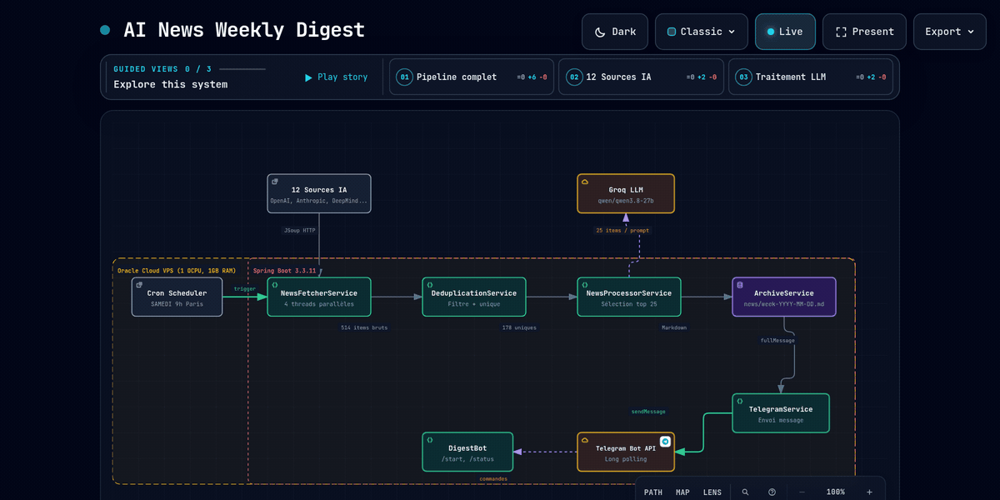

# NeuralPulse — AI News Weekly Digest

Pipeline automatique qui scrappe 12 sources IA chaque semaine, les résume via Groq LLM, et envoie un digest pédagogique en français sur Telegram.

## Architecture

<p align="center">
  
</p>

<details>
<summary>Vue interactive (pan/zoom, thème clair/sombre)</summary>

**[Ouvrir le diagramme interactif](docs/architecture.html)** — clic pour explorer avec vues guidées.

```mermaid
flowchart LR
    CRON["⏰ Cron\nSAMEDI 9h Dakar"] --> FETCH

    subgraph FETCH["📡 NewsFetcherService"]
        direction TB
        S1["OpenAI"] --> PAR
        S2["Anthropic"] --> PAR
        S3["DeepMind"] --> PAR
        S4["Meta AI"] --> PAR
        S5["Mistral"] --> PAR
        S6["HuggingFace"] --> PAR
        S7["The Batch"] --> PAR
        S8["TLDR AI"] --> PAR
        S9["Import AI"] --> PAR
        S10["Rundown AI"] --> PAR
        S11["Papers With Code"] --> PAR
        S12["daily.dev"] --> PAR
        PAR["4 threads\nJSoup HTTP"]
    end

    FETCH -->|"514 items"| DEDUP

    subgraph DEDUP["🔍 DeduplicationService"]
        FILTRE["Filtre doublons\n+ scoring"]
    end

    DEDUP -->|"178 uniques"| PROC

    subgraph PROC["🧠 NewsProcessorService"]
        direction TB
        SEL["Sélection top 25"] --> GROQ
        GROQ["Groq API\nqwen3.8-27b"] --> CLEAN["Nettoyage\nMarkdown"]
    end

    PROC --> ARCH
    PROC -->|"fallback si erreur"| FALLBACK["📋 Digest brut\nsans LLM"]

    subgraph ARCH["💾 ArchiveService"]
        MD["news/week-YYYY-MM-DD.md"]
    end

    ARCH --> TGSVC

    subgraph TGSVC["📤 TelegramService"]
        MSG["Envoi message\n4000 chars max"]
    end

    TGSVC --> TGAPI["🤖 Telegram Bot API"]

    BOT["DigestBot\n/start · /status"] <-->|"long polling"| TGAPI

    style CRON fill:#f59e0b,stroke:#d97706,color:#000
    style GROQ fill:#8b5cf6,stroke:#7c3aed,color:#fff
    style TGAPI fill:#38bdf8,stroke:#0ea5e9,color:#000
    style MD fill:#10b981,stroke:#059669,color:#fff
    style FALLBACK fill:#f97316,stroke:#ea580c,color:#fff
```

</details>



## Stack

| Composant | Technologie |
|-----------|-------------|
| Runtime | Java 17 JRE |
| Framework | Spring Boot 3.3.11 |
| Scraping | JSoup 1.18.1 |
| LLM | Groq API — qwen/qwen3.8-27b |
| Bot | TelegramBots 10.3.0 (long-polling) |
| BDD | SQLite (sqlite-jdbc 3.53.4.0) |
| Infra | Oracle Cloud VPS — 1 OCPU, 1GB RAM |
| Deploy | systemd (pas Docker) |

## Deployment

```bash
# Build
mvn clean package -DskipTests

# Sur le VPS
sudo mkdir -p /opt/ai-news-digest && sudo chown ubuntu:ubuntu /opt/ai-news-digest
scp target/ai-news-digest-1.0.0.jar ubuntu@170.9.35.21:/opt/ai-news-digest/

# Service
sudo systemctl enable ai-news-digest
sudo systemctl start ai-news-digest

# Logs
sudo journalctl -u ai-news-digest -f
```

## Endpoints

| Route | Méthode | Description |
|-------|---------|-------------|
| `/health` | GET | État du service + dernière exécution |
| `/api/test-digest` | POST | Déclenche un digest manuel |

## Configuration

Variables d'environnement (`.env`) :

```
TELEGRAM_BOT_TOKEN=...
TELEGRAM_CHAT_ID=...
GROQ_API=...
```

## Sources scrapées

| Source | Type | Régularité |
|--------|------|------------|
| OpenAI Blog | Blog officiel | Hebdo |
| Anthropic Research | Blog officiel | Hebdo |
| Google DeepMind | Blog officiel | Hebdo |
| Meta AI | Blog officiel | Hebdo |
| Mistral AI | Blog officiel | Hebdo |
| Hugging Face | Blog + Papers | Quotidien |
| The Batch (Andrew Ng) | Newsletter | Hebdo |
| TLDR AI | Newsletter | Quotidien |
| Import AI (Jack Clark) | Newsletter | Hebdo |
| The Rundown AI | Newsletter | Quotidien |
| Papers With Code | Papers trending | Quotidien |
| daily.dev | Agrégateur | Quotidien |

## License

Projet personnel — étudiant en IA & Big Data.
